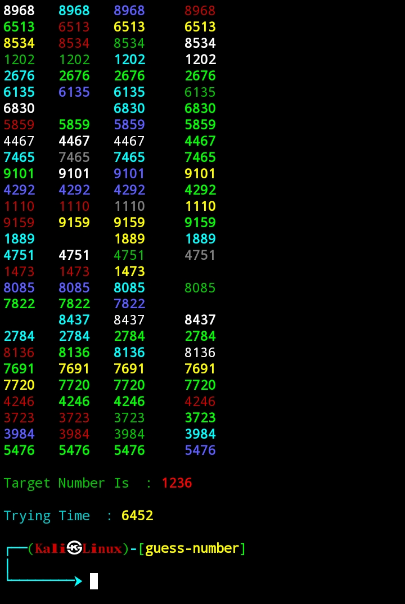
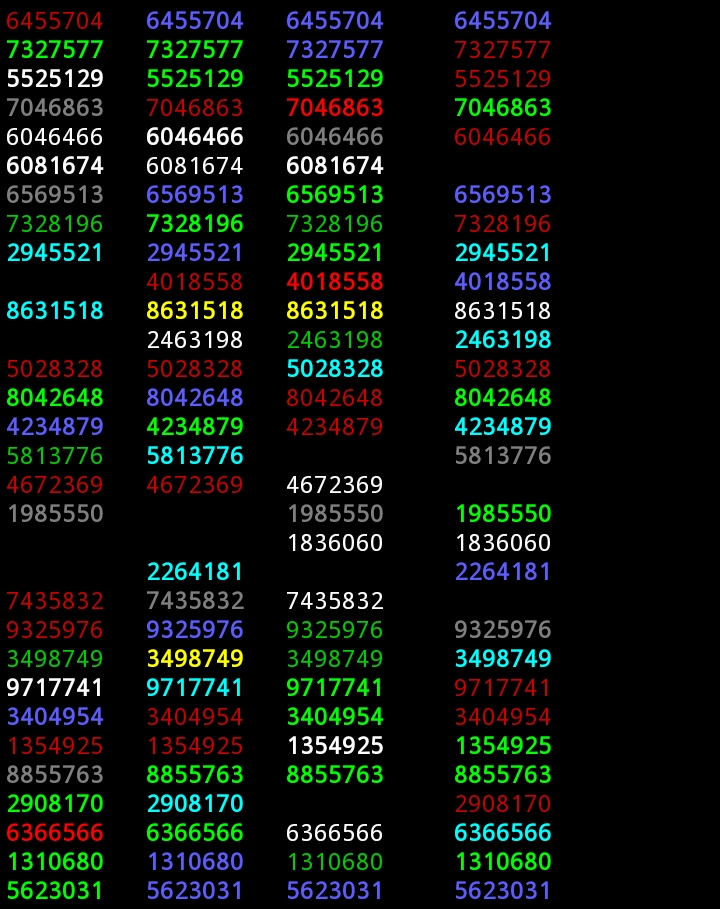

<center>

## Guess The Number 

## Web Developer Ghs Julian

### This Is Really Amazing Program Enter Any 8 Digits Number , It'll Find Just
In Few Seconds 👩‍💻
```python
def check_num(num):
    num_len = len(num)
    if len(str(10)) == num_len:
        return random.randint(10,99)
    elif len(str(100)) == num_len:
        return random.randint(100,999)
    elif len(str(1000)) == num_len:
        return random.randint(1000,9999)
    elif len(str(10000)) == num_len:
        return random.randint(10000,99999)
    elif len(str(100000)) >= num_len:
        return random.randint(100000,999999)
    elif len(str(1000000)) >= num_len:
        return random.randint(1000000,9999999)
    elif len(str(10000000)) >= num_len:
        return random.randint(10000000,99999999)
    else:
        return 0
```


## Screenshots And Demo :


<br><br><br>


</center>